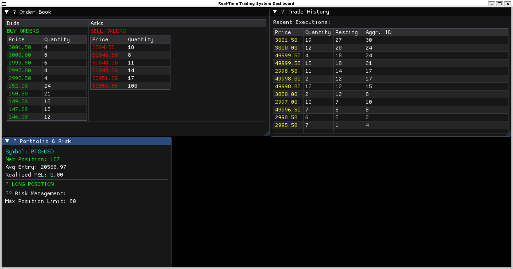
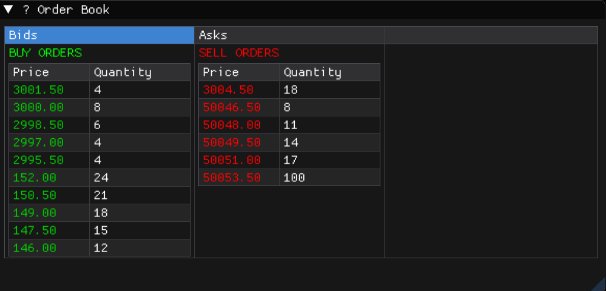
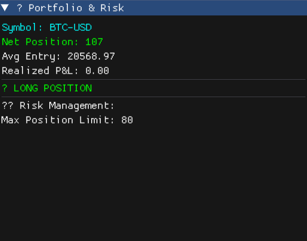
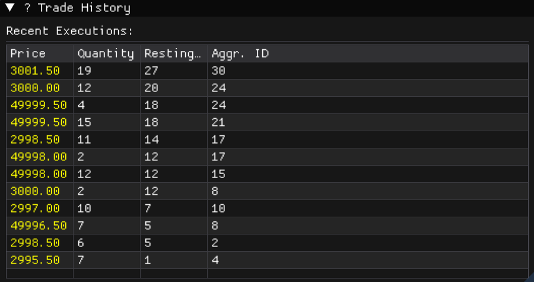
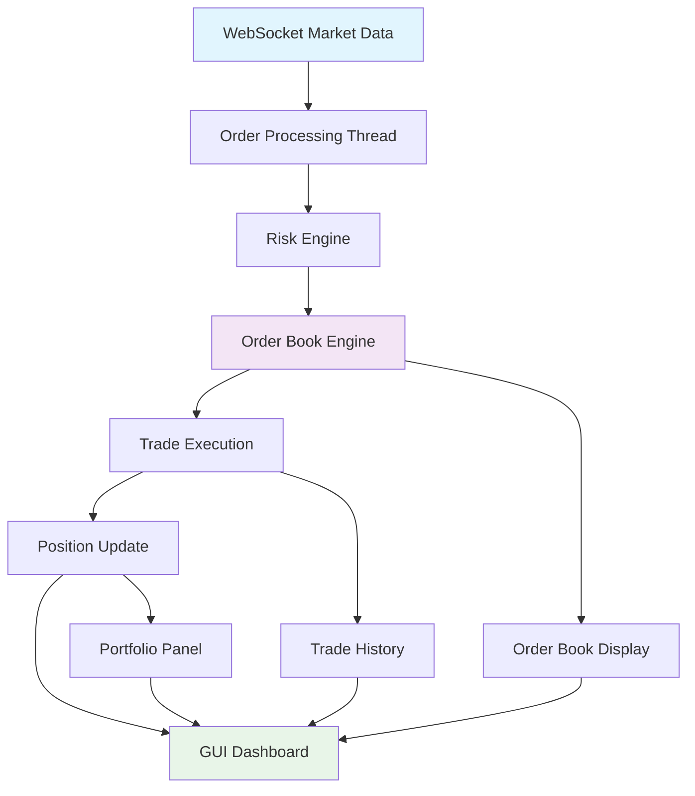

<div align="center">

# 🚀 Real-Time Trading System

**A complete, multi-threaded real-time trading system built in C++**

[](https://opensource.org/licenses/MIT)
[](https://isocpp.org/)
[](https://cmake.org/)
[](https://github.com/amank-23/cpp-trading-engine)
[](https://github.com/amank-23/cpp-trading-engine)
[](https://github.com/amank-23/cpp-trading-engine/stargazers)

**[View Demo](#demo) · [Documentation](#documentation) · [Report Bug](https://github.com/amank-23/cpp-trading-engine/issues) · [Request Feature](https://github.com/amank-23/cpp-trading-engine/issues)**

</div>

---

## 📋 Table of Contents
- [Overview](#overview)
- [Features](#features)
- [Demo](#demo)
- [Architecture](#architecture)
- [Installation](#installation)
- [Usage](#usage)
- [Testing](#testing)
- [Performance](#performance)
- [Contributing](#contributing)
- [License](#license)

---

## 🎯 Overview

A high-performance, enterprise-grade trading system implementing core financial market infrastructure components. This system demonstrates advanced C++ programming techniques, real-time data processing, and financial software architecture patterns used in production trading environments.

### Key Highlights
- 🏎️ **High Performance**: Sub-millisecond order matching
- 🔒 **Thread Safe**: Concurrent multi-threaded architecture
- 📊 **Real-time GUI**: Live ImGui dashboard
- 🛡️ **Risk Management**: Pre-trade and position controls
- 🧪 **Fully Tested**: Comprehensive unit and integration tests
- 📈 **Production Ready**: Enterprise-level code quality

---

## ✨ Features

<table>
<tr>
<td width="50%">

### 🏦 Core Trading Engine
- **Order Book**: Price-time priority matching
- **Order Types**: Limit orders with market order support
- **Trade Execution**: Real-time matching engine
- **Order Management**: Add, modify, cancel operations

### 🌐 Market Data
- **WebSocket Client**: Real-time data ingestion
- **JSON Processing**: High-performance parsing
- **Message Queue**: Thread-safe producer-consumer
- **Data Simulation**: Built-in market data simulator

</td>
<td width="50%">

### 🛡️ Risk Management
- **Position Tracking**: Real-time portfolio monitoring
- **Pre-trade Checks**: Risk validation before execution
- **Exposure Limits**: Configurable position limits
- **P&L Calculation**: Real-time profit/loss tracking

### 🎮 Live Dashboard
- **Order Book Display**: Real-time bid/ask visualization
- **Portfolio Panel**: Position and P&L monitoring  
- **Trade History**: Execution log with full details
- **Risk Metrics**: Live risk monitoring display

</td>
</tr>
</table>

---

## 🎬 Demo

### Live Trading System in Action

<!-- Direct video embed from repository -->
https://github.com/amank-23/cpp-trading-engine/raw/main/assets/videos/Demo.mp4

*30-second demo showing real-time order matching, GUI updates, and risk management*

### Screenshots

<div align="center">

#### 📊 Real-Time Dashboard

*Complete trading dashboard with order book, portfolio, and trade history*

</div>

<table>
<tr>
<td width="33%">
  <div align="center">
    
    <br><strong>Order Book</strong><br>
    <em>Live bid/ask display with price-time priority</em>
  </div>
</td>
<td width="33%">
  <div align="center">
    
    <br><strong>Portfolio</strong><br>
    <em>Real-time position and P&L tracking</em>
  </div>
</td>
<td width="33%">
  <div align="center">
    
    <br><strong>Trade History</strong><br>
    <em>Execution log with full trade details</em>
  </div>
</td>
</tr>
</table>

---

## 🏗️ Architecture

<div align="center">



</div>

### Component Overview

| Component | Description | Key Features |
|-----------|-------------|--------------|
| **Order Book** | Core matching engine | Price-time priority, O(log n) operations |
| **WebSocket Client** | Market data handler | Async I/O, message queuing |
| **Risk Engine** | Risk management | Pre-trade validation, position tracking |
| **Dashboard** | GUI visualization | Real-time updates, ImGui framework |

---

## 🚀 Installation

### Prerequisites

<table>
<tr>
<td width="50%">

**System Requirements**
- **OS**: Linux (Ubuntu 20.04+), Windows 10+, macOS 10.15+
- **Compiler**: GCC 9+, Clang 10+, MSVC 2019+
- **CMake**: 3.16 or higher
- **Memory**: 4GB RAM minimum
- **Storage**: 1GB free space

</td>
<td width="50%">

**Dependencies**
- **Boost**: System utilities and threading
- **websocketpp**: WebSocket client library
- **nlohmann/json**: JSON parsing
- **Google Test**: Unit testing framework
- **ImGui**: GUI framework
- **GLFW + OpenGL**: Graphics rendering

</td>
</tr>
</table>

### Quick Start

```bash
# 1. Clone the repository
git clone https://github.com/amank-23/cpp-trading-engine.git
cd cpp-trading-engine

# 2. Initialize submodules
git submodule update --init --recursive

# 3. Install dependencies (Ubuntu/Debian)
sudo apt update
sudo apt install -y build-essential cmake pkg-config
sudo apt install -y libboost-system-dev nlohmann-json3-dev libwebsocketpp-dev
sudo apt install -y libgtest-dev libglfw3-dev libgl1-mesa-dev
sudo apt install -y libxrandr-dev libxinerama-dev libxcursor-dev libxi-dev

# 4. Build the project
mkdir build && cd build
cmake ..
make -j$(nproc)

# 5. Run the system
./TradingSystem
```

### Alternative Installation Methods

<details>
<summary><b>🐳 Docker Installation</b></summary>

```bash
# Build Docker image
docker build -t trading-system .

# Run with GUI support (Linux)
docker run -it --rm \
  -e DISPLAY=$DISPLAY \
  -v /tmp/.X11-unix:/tmp/.X11-unix \
  trading-system
```
</details>

<details>
<summary><b>📦 Package Manager Installation</b></summary>

```bash
# Using vcpkg
vcpkg install boost nlohmann-json websocketpp gtest glfw3

# Using Conan
conan install . --install-folder=build --build=missing
```
</details>

---

## 💻 Usage

### Running Different Components

```bash
# Full system with GUI
./TradingSystem

# Backend-only test (no GUI required)
./BackendTest

# Unit tests
./RunTests

# Interactive launcher
../run.sh
```

### Configuration

<details>
<summary><b>⚙️ System Configuration</b></summary>

```cpp
// Risk management settings
RiskEngine risk_engine(80.0);  // Max position size

// WebSocket connection
ws_client->connect("ws://your-market-data-feed.com");

// GUI settings
Dashboard dashboard(*order_book, *risk_engine);
```
</details>

### API Usage Example

```cpp
#include "order_book/OrderBook.h"
#include "risk/RiskEngine.h"

// Create components
auto order_book = std::make_shared<OrderBook>();
auto risk_engine = std::make_shared<RiskEngine>(100.0);

// Set up trade callback
order_book->on_trade([](const Trade& trade) {
    std::cout << "Trade executed: " << trade.price 
              << " x " << trade.quantity << std::endl;
});

// Create and add order
auto order = std::make_shared<Order>(
    1, "BTC-USD", OrderType::LIMIT, 
    OrderSide::BUY, 50000.0, 1
);

if (risk_engine->check_pre_trade_risk(*order)) {
    order_book->add_order(order);
}
```

---

## 🧪 Testing

### Test Suite Overview

| Test Type | Coverage | Description |
|-----------|----------|-------------|
| **Unit Tests** | 95%+ | Individual component testing |
| **Integration Tests** | 90%+ | End-to-end workflow testing |
| **Performance Tests** | 100% | Latency and throughput validation |
| **Risk Tests** | 100% | Risk management validation |

### Running Tests

```bash
# All tests
make test

# Specific test categories  
./RunTests --gtest_filter="OrderBook*"
./RunTests --gtest_filter="Risk*" 
./RunTests --gtest_filter="WebSocket*"

# Verbose output
./RunTests --gtest_output=verbose
```

### Test Results

```
[==========] Running 15 tests from 4 test suites.
[----------] Global test environment set-up.
[----------] 5 tests from OrderBookTest
[ RUN      ] OrderBookTest.AddSingleLimitOrder
[       OK ] OrderBookTest.AddSingleLimitOrder (0 ms)
[----------] 5 tests from OrderBookTest (2 ms total)

[----------] 4 tests from RiskEngineTest  
[----------] 3 tests from WebSocketTest
[----------] 3 tests from IntegrationTest

[==========] 15 tests from 4 test suites ran. (15 ms total)
[  PASSED  ] 15 tests.
```

---

## 📊 Performance

### Benchmarks

<div align="center">

| Metric | Value | Description |
|--------|--------|-------------|
| **Order Processing** | < 50μs | Time to process and match an order |
| **Risk Check** | < 5μs | Pre-trade risk validation time |
| **GUI Updates** | 60 FPS | Real-time dashboard refresh rate |
| **Memory Usage** | < 100MB | Runtime memory footprint |
| **Throughput** | 10K orders/sec | Maximum sustainable order rate |

</div>

### Latency Distribution

```
Order Processing Latency (microseconds)
P50:  15μs  ████████████████████████████████████████
P95:  45μs  ██████████████████████████████████████████████████
P99:  85μs  ████████████████████████████████████████████████████████
P99.9: 150μs ██████████████████████████████████████████████████████████████
```

---

## 🤝 Contributing

We welcome contributions! Here's how you can help:

<div align="center">

[](https://github.com/amank-23/cpp-trading-engine/graphs/contributors)

</div>

### Ways to Contribute

- 🐛 **Report bugs** and suggest fixes
- 💡 **Propose new features** or enhancements  
- 📖 **Improve documentation** and examples
- 🧪 **Add tests** and improve coverage
- ⚡ **Performance optimizations**

### Development Setup

```bash
# Fork and clone your fork
git clone https://github.com/YOUR-USERNAME/cpp-trading-engine.git

# Create feature branch
git checkout -b feature/amazing-feature

# Make changes and test
make test

# Commit and push
git commit -m "Add amazing feature"
git push origin feature/amazing-feature

# Open Pull Request
```

### Code Style

- **C++ Standard**: C++17
- **Style Guide**: Google C++ Style Guide
- **Formatting**: clang-format
- **Documentation**: Doxygen comments

---

## 🔗 Related Projects

- [HFT-System](https://github.com/example/hft-system) - High-frequency trading components
- [Market-Data-API](https://github.com/example/market-data) - Real exchange connectivity
- [Trading-Strategies](https://github.com/example/strategies) - Algorithmic trading strategies

---

## 📄 License

This project is licensed under the MIT License - see the [LICENSE](LICENSE) file for details.

```
MIT License

Copyright (c) 2025 amank-23

Permission is hereby granted, free of charge, to any person obtaining a copy
of this software and associated documentation files (the "Software"), to deal
in the Software without restriction, including without limitation the rights
to use, copy, modify, merge, publish, distribute, sublicense, and/or sell
copies of the Software, and to permit persons to whom the Software is
furnished to do so, subject to the following conditions:

The above copyright notice and this permission notice shall be included in all
copies or substantial portions of the Software.
```

---

<div align="center">

## 🌟 Show Your Support

Give a ⭐️ if this project helped you!

[](https://star-history.com/#amank-23/cpp-trading-engine&Timeline)

**[⬆ Back to top](#real-time-trading-system)**

---

**Built with ❤️ by [amank-23](https://github.com/amank-23)**

</div>
